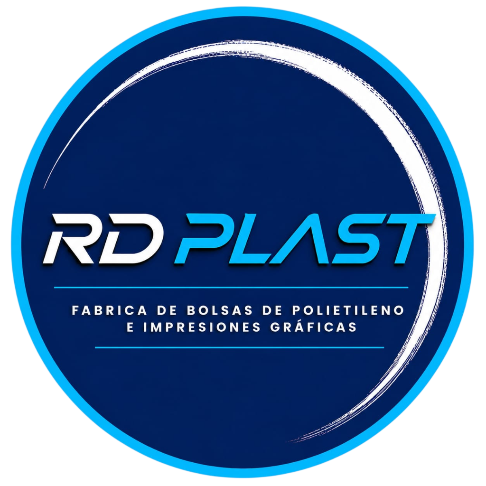
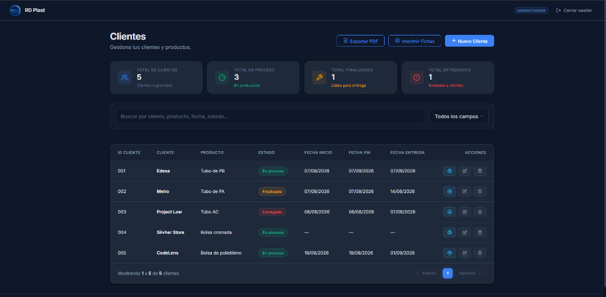
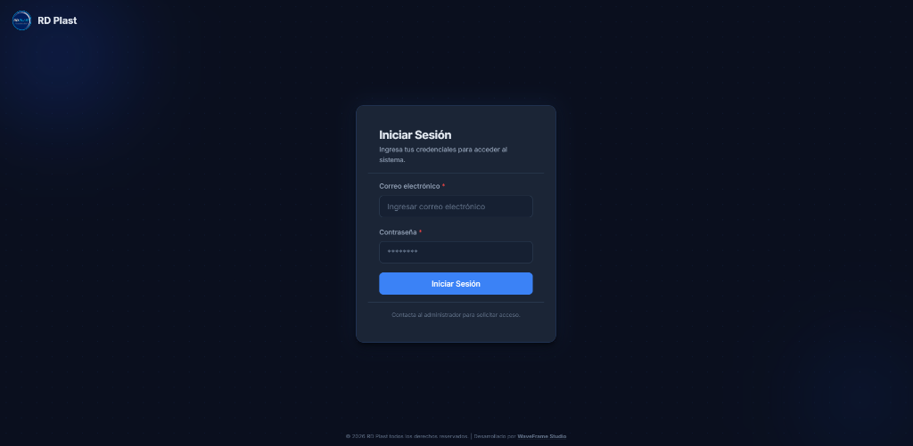
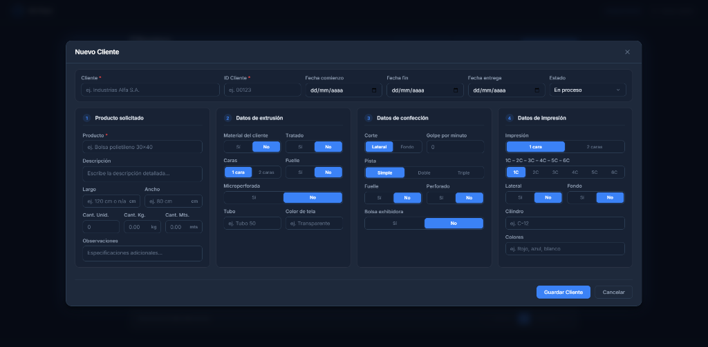
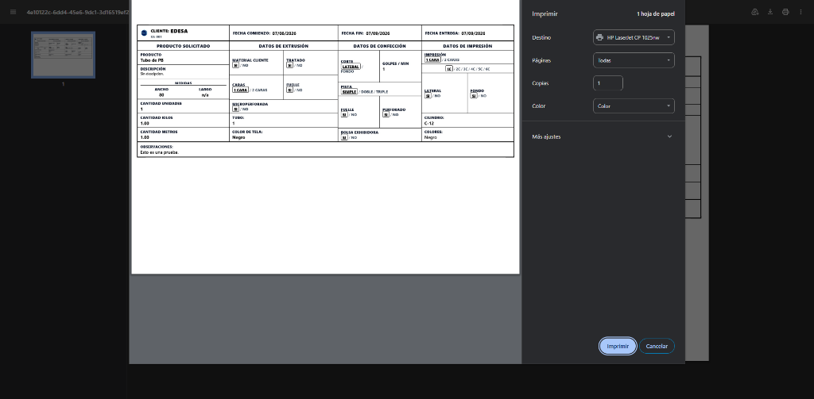
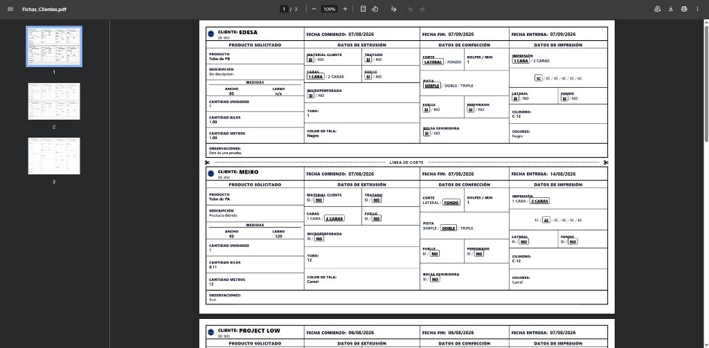

  

  # RD Plast — Control & Gestión Industrial

  **Sistema Integral de Gestión de Clientes, Pedidos y Fichas Técnicas de Producción**

  
  
  
  

---

## ✨ Características Principales

* 📊 **Panel de Control en Tiempo Real**: Tarjetas dinámicas (KPIs) con métricas automáticas de pedidos en proceso, finalizados y entregados según las fechas programadas.
* 📋 **Fichas Técnicas de Producción**: Control exhaustivo para sectores de **Extrusión**, **Confección** e **Impresión** (Material cliente, Tratado, Fuelle, Microperforado, Medidas, Kilos, Metros, Cilindro, Colores, etc.).
* 🖨️ **Exportación e Impresión en PDF de Alta Calidad**: Generación de documentos formato A4 horizontal listos para imprenta/planta, individuales o masivos con línea de corte incorporada.
* 🔍 **Filtro y Búsqueda Inteligente**: Búsqueda instantánea multi-campo por Cliente, ID, Producto, Fechas y Estado.
* 🔒 **Seguridad y Perfiles de Usuario**: Control de acceso autenticado y roles de usuario (Administrador / Operario).
* 🎨 **Interfaz Ultra-Moderna**: Diseño en modo oscuro optimizado para alta visibilidad y dinamismo operativo.

---

## 📌 Vista Principal del Dashboard

  

---

## 🖼️ Galería de Capturas del Sistema

### 📱 Módulos del Sistema

<table>
  <tr>
    <td width="50%" align="center">
      <b>Inicio de Sesión y Autenticación</b>
        
      
    </td>
    <td width="50%" align="center">
      <b>Carga y Edición de Ficha Técnica</b>
        
      
    </td>
  </tr>
  <tr>
    <td width="50%" align="center">
      <b>Vista Previa de Impresión Individual</b>
        
      
    </td>
    <td width="50%" align="center">
      <b>Generación Masiva de PDF (A4)</b>
        
      
    </td>
  </tr>
</table>

---

## 🛠️ Tecnologías Utilizadas

- **Frontend**: React 19, TypeScript, Vite.
- **Estilos**: Vanilla CSS moderno con variables, Glassmorphism y CSS Grid/Flexbox.
- **Base de Datos y Auth**: Supabase.
- **Librerías de Utilidad**: `html2pdf.js`, `gsap`, `react-router-dom`.

---

  
<i>Desarrollado para RD Plast — Fábrica de Bolsas</i>

